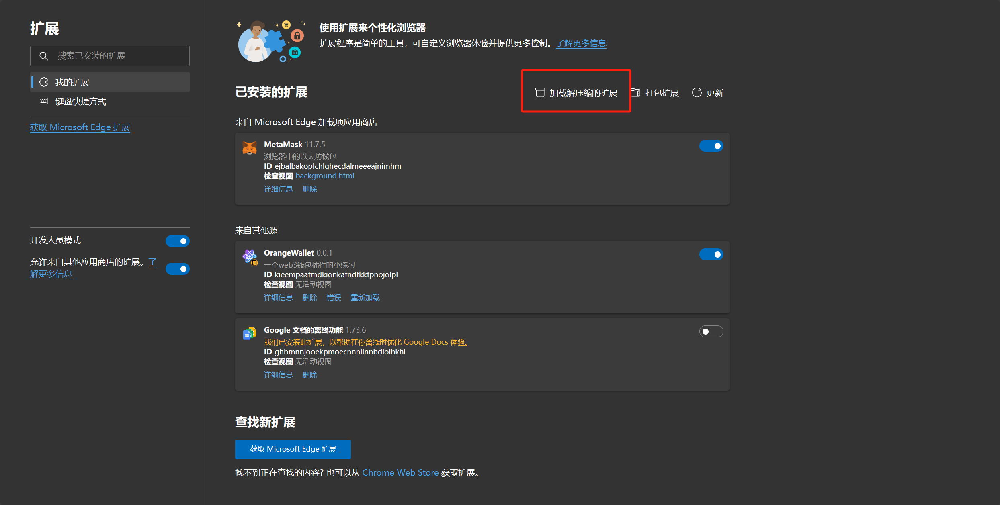
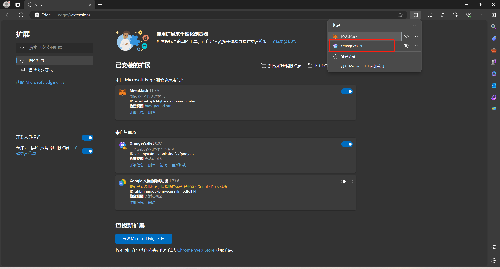
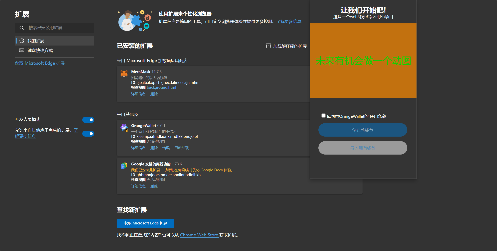
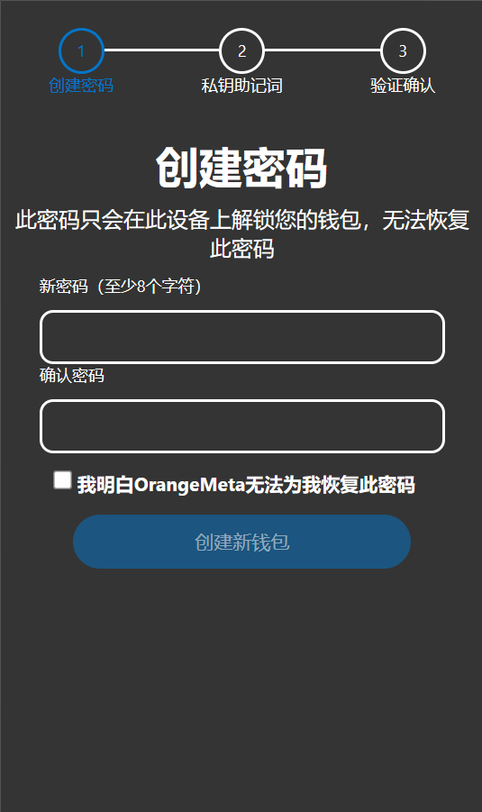
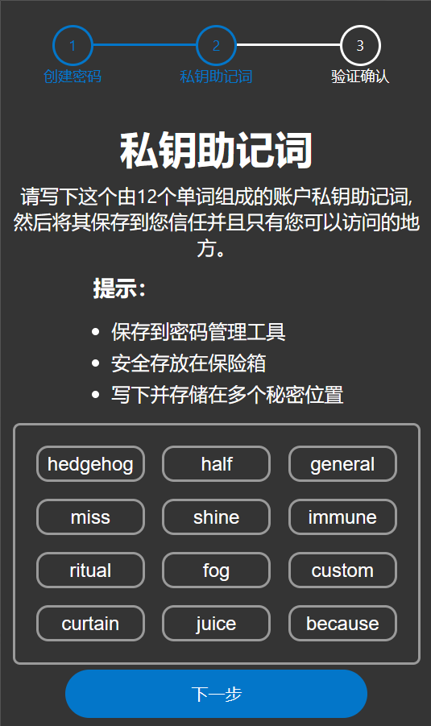
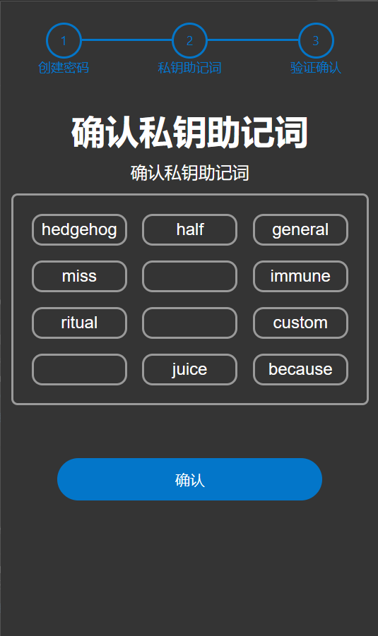
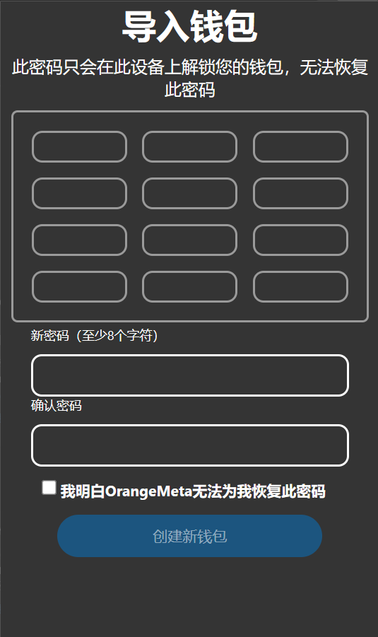
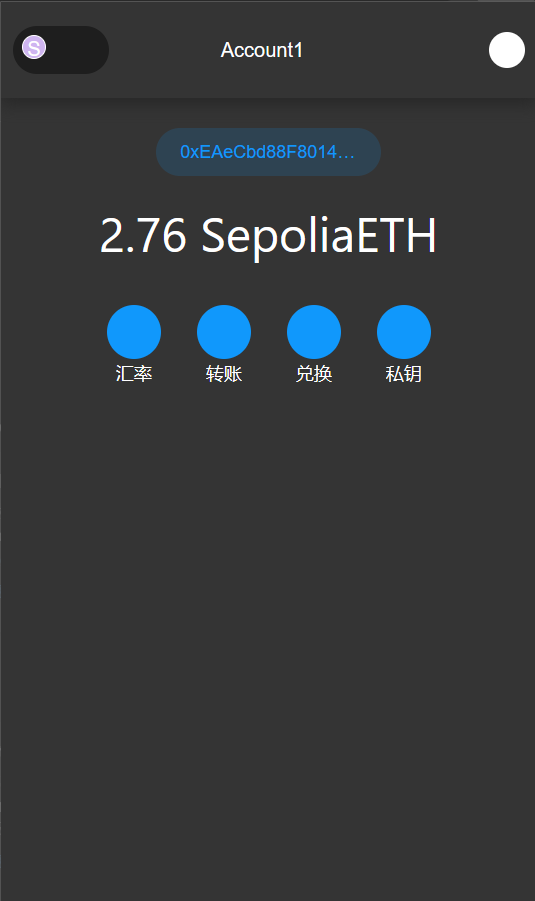
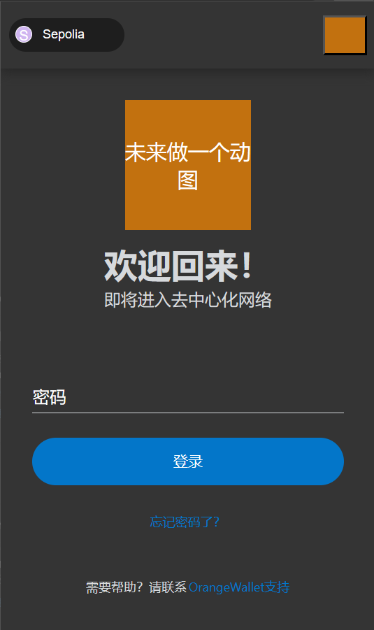

# 项目名称

这是一个 web3 钱包的小项目，用于学习和练习使用

## 目录

1. 简介
2. 功能特点
3. 安装
4. 使用示例
5. 配置
6. 贡献者
7. 许可证

## 简介

这个小项目是一个 web3 钱包的浏览器插件，目前完成了主要界面的设计。页面的设计是参照的是 metamask 的界面来画的，目前钱包的功能只完成了获取地址和余额的部分。关于网络部分，目前只做了 sepolia 测试网的部分，账户余额也只能查询 sepolia 测试网下的余额，未来或许会迭代其他网络和一些其他功能（包括转账、私钥、喂价），和智能合约的交互未来也会实现。作为初代版本的练习，暂时先做到这个程度。

## 功能特点

- 显示余额
- 复制钱包地址

## 安装

```bash
$ git clone https://github.com/JZNMCO55/wallet.git
$ cd wallet
$ npm install
```

## 使用示例

1. 构建项目：

```bash
npm run build
```

2. 打开谷歌浏览器或 Edge 浏览器，输入 edge://extensions 或 chrome://extension, 点击加载解压缩的扩展。然后加载 out 目录，点击插件图标开始使用。
   
   然后加载 out 目录

3.点击插件：



4.开始界面：



ps:中间的动图未来迭代的时候会去做，因为觉得还挺有趣的，目前先暂时用一块颜料挡着~

创建钱包：







导入钱包：


ps:可以将助记词复制到任意一个输入框中，但目前只支持 12 助记词的钱包

主页面:


ps:目前主页面的功能尚未完成

登录页面:



## 许可证

该项目基于 MIT License 发布。
